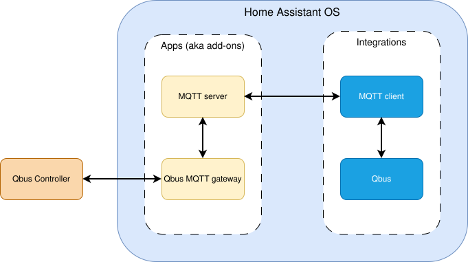

# QBUSMQTT

Exposes states and events of the Qbus Home Automation system to a MQTT broker.

QBUSMQTT is also available as a Docker image: https://github.com/thomasddn/qbusmqtt.

![Supports aarch64 Architecture][aarch64-shield]
![Supports amd64 Architecture][amd64-shield]

## 🥤 Snack-fueled coding 

You know what goes great with open-source coding? Snacks! If my project helped you out, maybe throw a little something my way so my potato chips and Coca-Cola stash doesn't run out!

[![ko-fi sponsor][kofi-sponsor-shield]][kofi-sponsor]
[![github sponsor][github-sponsor-shield]][github-sponsor]

## 🛠️ Setup

### Prerequisites

- Qbus home automation system (hardware)
- MQTT broker

> [!IMPORTANT]  
> QBUSMQTT and the controller(s) must be in the same subnet.

### 📦 Dependencies

This add-on requires MQTT.

## ⚙️ Architecture

In this setup, the gateway publishes Qbus states and events to MQTT topics and listens for MQTT commands, so Home Assistant can both monitor and control your Qbus installation using its MQTT and Qbus integrations.

Data flow is bidirectional end-to-end:

- Qbus events and state changes flow from the controller to the gateway, then to the MQTT broker, and finally to Home Assistant.
- Commands from Home Assistant flow back through MQTT to the gateway, which forwards them to the Qbus Controller.

> [!NOTE]  
> If you are running Home Assistant as a docker container, use [QBUSMQTT for docker](https://github.com/thomasddn/qbusmqtt/) instead.

## 🗣️ Remarks

This is **not** officially supported by Qbus.

[aarch64-shield]: https://img.shields.io/badge/aarch64-yes-green.svg?style=flat-square
[amd64-shield]: https://img.shields.io/badge/amd64-yes-green.svg?style=flat-square
[kofi-sponsor-shield]: https://img.shields.io/badge/Support_me_on_Ko--fi-%E2%9D%A4-fe8e86?style=for-the-badge&logo=kofi&logoColor=ffffff
[kofi-sponsor]: https://ko-fi.com/N4N7UZ6KN
[github-sponsor-shield]: https://img.shields.io/badge/Support_me_on_GitHub-%E2%9D%A4-fe8e86?style=for-the-badge&logo=github&color=fe8e86
[github-sponsor]: https://github.com/sponsors/thomasddn
